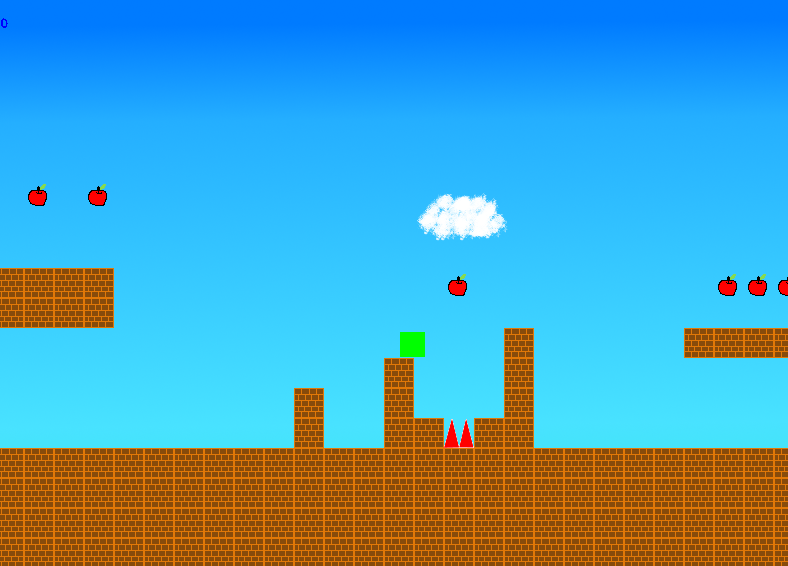

# ActionGameJava

JavaのSwingで、横スクロールゲームを作ってみました。



## 操作方法
|キー|説明|
|:---:|:---:|
|z|決定 and ジャンプ|
|Enter|決定|
|space|決定 and ジャンプ|
|矢印キー|メニュー選択 and 移動|


## jarファイルの作り方/起動の仕方

```bash
cd <このリポジトリ>
sbt assembly
java -jar target/ActionGameJava-assembly-0.1.jar
```